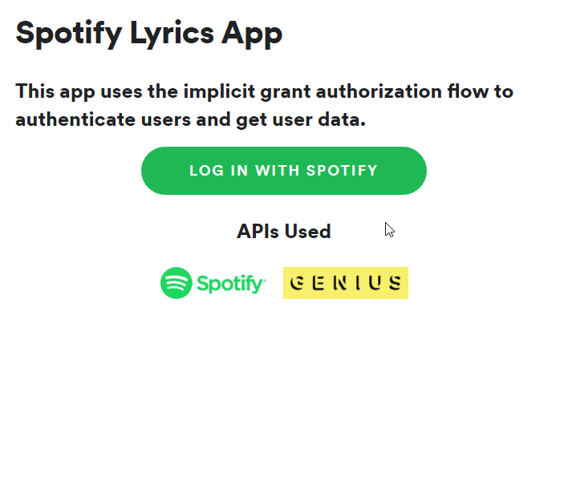

# spotify-lyrics-app

This is a simple app that allows users to see what song they currently have playing on Spotify using the Spotify API. It then searches the song using the Genius API, and scrapes the corresponding song page to display the lyrics. There are two parts to it, the server, and the client.

## Demo

## Using the App

### 1) Create an App on Spotify

- Visit https://developer.spotify.com
- Log in and create an app
- Enter http//localhost:8888 as the redirect uri
- Save your changes
- Copy down the following: client_id

### 2) Start Auth Server

- Navigate to the server directory `cd server`
- Install the dependencies `npm install`
- Paste in the client_id you copied in step 1
- Run the Server `node server.js`

### 3) Start Client

- Navigate to the client directory `cd client`
- Install the dependencies `npm install`
- Run the Server `npm start`

### 4) Use the App

- Make sure you have a song playing (or paused) on a Spotify app
- Visit http://localhost:3000
- Click the 'Log in with Spotify' button to authorize the app
- Click the 'Check Now Playing' button
- Your currently playing song's name, album art, and lyrics should appear

### Using your own credentials

The app contains a working client ID for both Spotify and Genius. Note, however, that they might be rate limited if they are used frequently. If you are planning to use the app for your own purposes, you should register your app and get your own credentials instead of using the ones in this project.

Go to [My Applications on Spotify Developer](https://developer.spotify.com/my-applications) and create your application.

Go to [API Clients on Genius Developer](https://genius.com/api-clients) and create your application.

Once you have created your app, replace the `client_id` in the examples with your own.

## Notes

Began with Spotify's [web-api-auth-examples](https://github.com/spotify/web-api-auth-examples). This repo contained basic demos showing the different OAuth 2.0 flows for [authenticating against the Spotify Web API](https://developer.spotify.com/web-api/authorization-guide/).

I originally wanted this app to be a simple frontend app, so I chose Implicit Grant flow as it is suited for clients that are implemented entirely using JavaScript and running in the resource owner’s browser, and not needing any server-side code. However, I later ran into issues when attempting to scrape the lyrics from the Genius.com song page, thus needing a backend anyways.

Genius does have an API endpoint for getting lyrics directly, probably due to lisensing issues, so I had to scrape the HTML content of the corresponding song page. I attempted to make a GET request from the browser to the given URL to obtain its HTML content, but this threw a non-descriptive error, "access blocked by CORS policy". Upon further research, I realized you can not make requests like this since it would be a security issue. My solution was to make the request from a backend server instead.

After getting the HTML content from the Genius.com song page, I used cheerio to parse the HTML and get just the lyrics, which were then rendered on the page.
